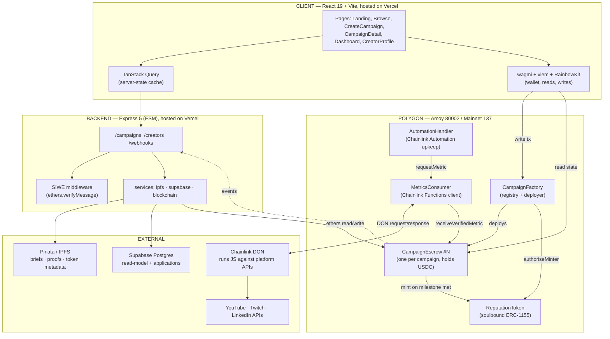
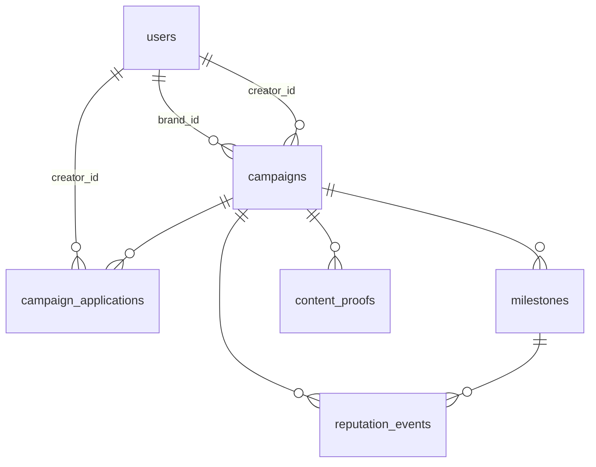

# Influencity v1 — Technical Documentation

Web3 influencer-marketing **escrow + marketplace** on Polygon.

A brand posts a funded campaign listing in USDC. Creators browse it and apply
with a pitch. The brand selects one applicant — that selection forms the
agreement on-chain. From there an oracle verifies the creator's real platform
metrics (YouTube / Twitch / LinkedIn), and each milestone that clears its
threshold automatically releases a USDC tranche to the creator and mints a
soulbound reputation NFT. Milestones that expire unmet refund their tranche to
the brand. No human approves a payment at any point.

> **Status (2026-09-21):** contracts audited, hardened and covered by **156
> passing tests**, including an end-to-end run through the real Chainlink
> wiring against a mock DON router. Backend and frontend are complete. Nothing
> is deployed yet — see [Known gaps](#12-known-gaps--limitations).

---

## Table of contents

1. [System overview](#1-system-overview)
2. [Technology stack](#2-technology-stack)
3. [External services](#3-external-services)
4. [Repository layout](#4-repository-layout)
5. [Smart contract layer](#5-smart-contract-layer)
6. [Off-chain data model (Supabase)](#6-off-chain-data-model-supabase)
7. [Backend API (Express)](#7-backend-api-express)
8. [Frontend (React + Vite)](#8-frontend-react--vite)
9. [End-to-end flows](#9-end-to-end-flows)
10. [Configuration & environment variables](#10-configuration--environment-variables)
11. [Build, test, deploy](#11-build-test-deploy)
12. [Known gaps & limitations](#12-known-gaps--limitations)

---

## 1. System overview

The system is split across four planes. The rule that shapes the whole
architecture: **money and truth live on-chain; everything else is a cache.**



### Design principles

| Principle | How it shows up |
|---|---|
| **Funds never touch a server** | USDC sits in a per-campaign `CampaignEscrow`. The backend has no withdrawal path — it can only read state and relay proof CIDs. |
| **Terms are immutable** | The campaign brief is pinned to IPFS and its CID is written into the escrow constructor. The agreed terms can never be edited after deployment. |
| **Payouts are non-discretionary** | Only `MetricsConsumer` can post a metric, and the escrow itself compares it to the threshold. Neither brand nor platform can withhold a met milestone. |
| **Postgres is a cache, not a source of truth** | Every write to Supabase happens *after* the corresponding transaction is confirmed on-chain. If the DB is wiped, the chain still holds all campaigns, balances, and reputation. |
| **Reputation cannot be bought** | `ReputationToken._update` reverts on any transfer, so tokens only ever move from `address(0)` to a creator. |
| **One escrow per campaign** | Blast radius of a bug or a stuck campaign is a single deal, not the protocol. |

---

## 2. Technology stack

### Smart contracts

| Item | Version / choice | Notes |
|---|---|---|
| Language | Solidity `0.8.24` | |
| Framework | Hardhat 3 (ESM config) | `hardhat.config.js`, `type: module` |
| Libraries | OpenZeppelin Contracts 5.x | `ReentrancyGuard`, `Ownable`, `ERC1155`, `IERC20` |
| Oracle SDK | `@chainlink/contracts` 1.5 | `FunctionsClient`, `AutomationCompatibleInterface` |
| Compiler settings | optimizer on, 200 runs, `evmVersion: "cancun"` | Cancun is live on Polygon post-Ahmedabad; nothing here needs Cancun opcodes, so `shanghai` is a safe fallback |
| Test runner | Node test runner via `@nomicfoundation/hardhat-node-test-runner` + Chai matchers | |
| Verification | `hardhat-verify` v3 against **Etherscan V2** | One multichain API key; standalone Polygonscan V1 keys are deprecated |

### Backend

| Item | Version / choice |
|---|---|
| Runtime | Node.js, ESM (`"type": "module"`) |
| Framework | Express 5 |
| Chain client | ethers v6 |
| DB client | `@supabase/supabase-js` v2 (service-role key) |
| IPFS client | `pinata` SDK v2 |
| Other | `cors`, `dotenv`, `nodemon` (dev) |

### Frontend

| Item | Version / choice |
|---|---|
| Framework | React 19 |
| Bundler | Vite 8 (`@vitejs/plugin-react`) |
| Wallet | wagmi 2 + viem 2 + RainbowKit 2 |
| Server state | TanStack Query v5 |
| Routing | react-router-dom 7 |
| Styling | Tailwind CSS 4 (`@tailwindcss/vite`) + shadcn/ui on Radix primitives |
| Forms | react-hook-form + zod (`@hookform/resolvers`) |
| Motion | framer-motion |
| Charts / toasts / icons | recharts · sonner · lucide-react |
| Fonts | `@fontsource-variable/geist` |

### Network

| | |
|---|---|
| Primary | **Polygon Amoy** testnet — chainId `80002` |
| Configured | **Polygon** mainnet — chainId `137` |
| Gas token | POL (not ETH) |
| Settlement asset | USDC, 6 decimals (`MockUSDC` on Amoy; `0x3c499c542cEF5E3811e1192ce70d8cC03d5c3359` on mainnet) |
| Confirmations | `TX_CONFIRMATIONS = 3` — Polygon PoS has ~2s blocks and routine short reorgs, and every write is followed by a Supabase persist |

---

## 3. External services

| Service | Used for | Where configured |
|---|---|---|
| **Polygon PoS** | Settlement chain for all contracts and USDC transfers | `hardhat.config.js`, `client/src/config/wagmi.js`, `RPC_URL` |
| **Supabase** (Postgres) | Off-chain read-model: users, campaigns, milestones, applications, proofs, reputation events. RLS on all tables — public `select`, writes only via the backend's service-role key | `supabase/migrations/`, `server/src/services/supabase.js` |
| **Pinata** (IPFS pinning) | Campaign briefs, creator content proofs, ERC-1155 token metadata | `server/src/services/ipfs.js`, `PINATA_JWT`, `PINATA_GATEWAY` |
| **Chainlink Functions** | Decentralised off-chain compute — each DON node independently calls the platform API and the network agrees on the result before it lands on-chain | `contracts/oracle/MetricsConsumer.sol`, `server/src/chainlink-functions/*.js` |
| **Chainlink Automation** | Time-based upkeep that sweeps campaigns every 24h and triggers metric checks — removes humans from the verification loop | `contracts/oracle/AutomationHandler.sol` |
| **YouTube Data API v3** | View / subscriber / watch-time counts | `fetchYouTubeMetrics.js` (runs on DON nodes, key passed as an encrypted DON secret) |
| **Twitch API** | Concurrent viewers, followers, views | `fetchTwitchMetrics.js` |
| **LinkedIn API** | Impressions, clicks, followers | `fetchLinkedInMetrics.js` |
| **WalletConnect** | Wallet connection relay behind RainbowKit | `VITE_WALLETCONNECT_PROJECT_ID` |
| **Alchemy Notify** (optional) | Push on-chain logs to `POST /webhooks/alchemy` for DB sync; the route normalises Alchemy's payload shape | `server/src/routes/webhooks.js`, `WEBHOOK_SECRET` |
| **Etherscan V2** | Contract source verification on Polygon + Amoy | `ETHERSCAN_API_KEY` |
| **Vercel** | Hosting for both the client (static Vite build) and the Express server | `client/vercel.json` |

---

## 4. Repository layout

```
Influencity_v1/
├── contracts/
│   ├── core/            CampaignFactory · CampaignEscrow · ReputationToken
│   ├── oracle/          MetricsConsumer · AutomationHandler
│   ├── libraries/       MilestoneLib
│   ├── interfaces/      ICampaignEscrow · IReputationToken
│   └── mocks/           MockUSDC · MockMetricsOracle
├── scripts/             deploy.js · verify.js · seedTestData.js
├── test/                CampaignEscrow · CampaignFactory · ReputationToken · OracleFlow
├── server/src/
│   ├── index.js         Express app — mounts /campaigns /creators /webhooks
│   ├── loadEnv.js       dotenv, imported FIRST, resolves <repo>/.env absolutely
│   ├── middleware/      auth.js — SIWE verification
│   ├── routes/          campaigns.js · creators.js · webhooks.js
│   ├── services/        ipfs.js (Pinata) · supabase.js · blockchain.js (ethers)
│   └── chainlink-functions/  JS executed by DON nodes (not by this server)
├── client/src/
│   ├── pages/           Landing · Browse · CreateCampaign · CampaignDetail
│   │                    · Dashboard · CreatorProfile · NotFound
│   ├── components/      campaign/ · wallet/ · layout/ · reputation/ · shared/ · ui/
│   ├── hooks/           useCampaign · useMilestones · useReputation · useIPFS · useSIWE
│   ├── config/          wagmi.js · contracts.js · supabase.js
│   └── lib/             constants.js (enum mirrors, USDC formatting) · utils.js
├── supabase/migrations/ 001_initial_schema.sql · 002_open_campaigns.sql
├── hardhat.config.js
├── deployments.json     written by scripts/deploy.js
└── ccvs.md              internal working notes
```

Sibling folders outside this directory: `Influencity_PRD_v1.pdf` (product
requirements), `influencity-readme.html` (styled overview), and `video/`
(a separate Remotion project for the promo video).

---

## 5. Smart contract layer

### 5.1 Contract map

| Contract | Type | Responsibility |
|---|---|---|
| `CampaignFactory` | Singleton | Deploys one escrow per campaign, holds the registry, binds creators |
| `CampaignEscrow` | One per campaign | Holds USDC, owns the milestone list, releases/refunds tranches |
| `ReputationToken` | Singleton | Soulbound ERC-1155 minted on every milestone met |
| `MetricsConsumer` | Singleton | Chainlink Functions client; the *only* address allowed to post metrics |
| `AutomationHandler` | Singleton | Chainlink upkeep; sweeps campaigns and requests fresh metrics |
| `MilestoneLib` | Library | Milestone struct, enums, threshold/expiry/validation helpers |
| `MockUSDC` | Mock | 6-decimal ERC-20 with an open `faucet()` for testnet |
| `MockMetricsOracle` | Mock | Stands in for `MetricsConsumer` in tests; injects metric values directly |

### 5.2 `MilestoneLib` — the shared vocabulary

```solidity
enum Platform        { YOUTUBE, TWITCH, LINKEDIN }                             // 0,1,2
enum MetricType      { VIEWS, CLICKS, FOLLOWERS, WATCH_TIME, CONCURRENT_VIEWERS } // 0..4
enum MilestoneStatus { PENDING, MET, FAILED }                                  // 0,1,2

struct Milestone {
    Platform        platform;       // which platform to measure
    MetricType      metricType;     // what to measure
    uint256         threshold;      // e.g. 50000 views
    uint256         trancheAmount;  // USDC released on success (6 decimals)
    uint256         deadline;       // unix ts; past this, unmet = failed
    string          contentId;      // YouTube video id, Twitch clip slug, …
    string          ipfsProofHash;  // creator's proof CID
    MilestoneStatus status;
}
```

These integer values are mirrored verbatim in `client/src/lib/constants.js` and
in the Postgres `check` constraints — the three layers must be changed together.

Helpers: `isExpired`, `isPending`, `isValidMilestone` (threshold > 0,
tranche > 0, deadline in the future), `isThresholdMet` (`reported >= threshold`).

### 5.3 `CampaignFactory`

State: `campaignCount`, `campaignEscrows[id]`, `brandCampaigns[addr][]`,
`creatorCampaigns[addr][]`, plus the protocol addresses (`usdc`,
`reputationToken`, `metricsConsumer`) passed into every escrow.

```solidity
createCampaign(ipfsBriefHash, platforms[], metricTypes[],
               thresholds[], trancheAmounts[], deadlines[], contentIds[])
  → (campaignId, escrowAddress)
```

- Validates that all six milestone arrays are the same length and non-empty.
- Increments `campaignCount` (**IDs start at 1**).
- Deploys a fresh `CampaignEscrow` with `msg.sender` as the brand and **no creator**.
- Wires the escrow into the rest of the protocol: `authoriseMinter` on
  `ReputationToken`, `authoriseEscrow` on `MetricsConsumer`, and
  `registerCampaign` on the `AutomationHandler` when one is set. The last two
  were missing, which meant a real oracle deployment would have produced
  campaigns that could never be verified.
- Adds every milestone to the escrow (factory is `owner`, so `onlyOwner` passes).
- Emits `CampaignCreated(campaignId, escrowAddress, brand, ipfsBriefHash)`.

```solidity
assignCreator(campaignId, creator)   // caller must be the campaign's brand
```
Forwards to `escrow.assignCreator`, pushes the id into `creatorCampaigns`, emits
`CreatorAssigned`.

Admin: `updateProtocolAddresses(usdc, reputationToken, metricsConsumer)` for
redeploys of the oracle or reputation contract.

### 5.4 `CampaignEscrow` — the core

`ReentrancyGuard` + `Ownable` (owner = the factory).

**Lifecycle states** are derived, not a single enum:

```
OPEN        creator == 0 && !isFinalized          brand can cancel
BOUND       creator != 0 && !isFinalized          binding; cancel disabled
FINALIZED   isFinalized                           remainder returned to brand
CANCELLED   isCancelled && isFinalized            withdrawn before a creator was bound
```

| Function | Guard | Behaviour |
|---|---|---|
| `deposit(amount)` | `onlyBrand`, `notFinalized`, `nonReentrant` | One-shot (`totalDeposit == 0`). Must cover the sum of all milestone tranches. Pulls USDC via `transferFrom` — brand must `approve` first. Emits `CampaignFunded`. |
| `addMilestone(...)` | `onlyOwner` (factory) | Validates via `MilestoneLib`; if a deposit already exists, the new tranche must still fit inside it. Capped at `MAX_MILESTONES = 20` so the loops in `finalizeCampaign` and the automation sweep stay bounded. |
| `assignCreator(addr)` | `onlyOwner`, `notFinalized` | One-shot. Rejects zero address, `creator == brand`, and **an unfunded escrow** (`totalDeposit > 0`) — binding a creator to an empty escrow forms an agreement that can never pay out. **Deposit must therefore precede assignment.** |
| `submitProof(idx, cid)` | creator only, milestone `PENDING`, **before the deadline** | Stores the IPFS proof CID on the milestone. |
| `receiveVerifiedMetric(idx, value)` | **`onlyMetricsConsumer`**, `notFinalized`, `nonReentrant` | The only path to a payout. Requires a bound creator and a `PENDING` milestone. |
| `finalizeCampaign()` | brand or owner, `nonReentrant` | Fails every still-pending **expired** milestone, then returns the remainder to the brand. **Reverts if any milestone is still live** — without that guard the brand could sweep a tranche the creator was still earning. |
| `cancelCampaign()` | `onlyBrand`, **only while `creator == 0`** | Refunds the full balance and finalises. Once a creator is bound the agreement is binding. |

**The decision inside `receiveVerifiedMetric`:**

```
reported >= threshold  ──► _releaseTranche:  status = MET
                             ├─ USDC.transfer(creator, trancheAmount)
                             ├─ totalReleased += trancheAmount
                             ├─ ReputationToken.mint(creator, idx, campaignId)
                             └─ emit MilestoneMet

reported <  threshold
       └─ deadline passed ──► _failMilestone: status = FAILED
       │                        ├─ USDC.transfer(brand, trancheAmount)
       │                        └─ emit MilestoneFailed
       └─ deadline ahead  ──► stays PENDING, retried on the next upkeep
```

Events: `CampaignFunded`, `MilestoneAdded`, `MilestoneMet`, `MilestoneFailed`,
`MetricVerified`, `CampaignFinalized`, `CreatorAssigned`, `CampaignCancelled`.
(`CampaignInitialised` was declared but never emitted and described the old
pre-marketplace flow; `CampaignFunded` replaces it, since deposits were
otherwise invisible to event listeners.)

Views: `getMilestones`, `getMilestone(i)`, `getMilestoneCount`, `getBalance`.

### 5.5 `ReputationToken` — soulbound ERC-1155

- `name = "Influencity Reputation"`, `symbol = "IREP"`.
- `tokenId = uint256(keccak256(abi.encodePacked(campaignId, milestoneIndex)))` —
  every milestone across every campaign is its own token type.
- `mint` is `onlyAuthorisedMinter`; escrows are added to `authorisedMinters` by
  the factory at creation time (`authoriseMinter` accepts owner **or** the
  registered `campaignFactory`).
- Per-wallet `reputationScore` counter plus a full `mintHistory[]` of
  `{campaignId, milestoneIndex, tokenId, mintedAt}` records.
- **Soulbound enforcement** — `_update` reverts unless `from == address(0)`, so
  tokens can be minted but never transferred or burned.
- `uri(tokenId)` returns the per-token IPFS URI if one was set via
  `setTokenMetadataURI`, otherwise falls back to the base URI.

### 5.6 Oracle layer

**`MetricsConsumer`** (`FunctionsClient` + `ConfirmedOwner`)

- Stores one JS source string per platform (`setSourceCode(platform, code)`),
  the DON subscription id, DON id, and a **500k** callback gas limit — a
  milestone-met fulfillment *measures* 310,702 gas, so the previous 300k
  default would have run out mid-callback and silently failed to pay.
- `requestMetric(escrowAddress, milestoneIndex, platform, contentId)` —
  callable by an authorised escrow **or** the `automationHandler`. The escrow is
  an explicit parameter: requests are placed by the handler on an escrow's
  behalf, so inferring it from `msg.sender` filed every result against the
  handler and the metric never reached the escrow at all. Builds an inline-JavaScript
  Functions request with `contentId` as `args[0]`, sends it, and records a
  `RequestContext{escrowAddress, milestoneIndex, platform, fulfilled}` keyed by
  `requestId`.
- `fulfillRequest(requestId, response, err)` — the DON callback, which **never
  reverts**: a revert there burns the callback gas, marks the request failed
  upstream, and loses the paid-for result. Unknown ids, duplicates, malformed
  responses and an escrow that refuses the metric all emit
  `MetricDeliveryFailed` and return; DON-side errors emit
  `MetricRequestFailed`. Only a clean delivery emits `MetricFulfilled`.

**`AutomationHandler`** (`AutomationCompatibleInterface`)

- Registry of `schedules[campaignId] = {escrowAddress, lastCheckedAt, active}`.
- `checkUpkeep` runs **off-chain and free** — returns up to
  `maxCampaignsPerUpkeep` (default 5) campaigns whose `checkInterval`
  (default **24 hours**) has elapsed.
- `performUpkeep` runs on-chain, re-validates the interval, and for each
  campaign requests a fresh metric for every milestone still `PENDING` with a
  non-empty `contentId`. Each request is wrapped — one unrecoverable milestone
  emits `MetricCheckFailed` instead of aborting the sweep for every other
  campaign in the batch.
- Access is gated on the Chainlink **forwarder**: permissionless until
  `setForwarder` is called (necessary before the upkeep is registered and the
  forwarder is known), restricted afterwards so nobody else can spend the LINK.
- A **finalised campaign retires itself** on the next sweep, and its id is
  removed from `campaignIds` with a swap-and-pop, so `checkUpkeep` scans live
  campaigns rather than every campaign ever created.
- `forceCheck(campaignId)` (owner-only) runs a check immediately, since
  `checkInterval` has a one-hour floor that makes live demos impractical.
- `deactivateCampaign` stops the sweep; callable by the escrow itself or the owner.

**The DON-side scripts** in `server/src/chainlink-functions/` are *not* run by
the Express server — they are uploaded into `MetricsConsumer` and executed
independently by each Chainlink node. They read the API key from encrypted
DON-hosted `secrets`, call the platform API with a ~9s timeout (the DON limit
is ~10s), and return a single `uint256`.

### 5.7 Trust boundaries

| Actor | Can | Cannot |
|---|---|---|
| Brand | Create + fund a campaign, pick an applicant, cancel while open, finalize after deadlines | Edit terms, block a met milestone, cancel after binding a creator, touch a released tranche |
| Creator | Apply, submit proof CIDs | Trigger their own payout, change a threshold, transfer reputation |
| Backend wallet | Read chain state, relay proof CIDs | Move USDC, mint reputation, post metrics |
| `MetricsConsumer` | Post verified metrics | Move funds directly (only the escrow's own logic transfers) |
| Factory owner | Repoint protocol addresses for future campaigns | Alter or drain existing escrows |

---

## 6. Off-chain data model (Supabase)

Postgres with RLS enabled on every table. Policy shape is uniform: **public
`select`, no public writes** — all inserts and updates go through the backend's
service-role key, which bypasses RLS. An `update_updated_at()` trigger keeps
`updated_at` fresh on `users`, `campaigns`, `milestones`, and
`campaign_applications`.



| Table | Key columns | Purpose |
|---|---|---|
| `users` | `wallet_address` (unique), `role` ∈ {brand, creator}, `display_name`, `avatar_url` | Wallet is the identity; rows are created lazily on first authenticated action |
| `campaigns` | `campaign_id_onchain` (unique), `contract_address` (unique), `brand_address`, `creator_address` (nullable), `ipfs_brief_cid`, `status`, `total_deposit_usdc`, `total_released_usdc` | Mirror of escrow state. `status` ∈ `open · pending · active · completed · cancelled`, default `open` |
| `milestones` | `(campaign_id, milestone_index)` unique, `platform`, `metric_type`, `threshold`, `tranche_usdc`, `deadline`, `content_id`, `ipfs_proof_cid`, `verified_value`, `status` | Enum values match `MilestoneLib` exactly, enforced by `check` constraints |
| `campaign_applications` | `(campaign_id, creator_address)` unique, `pitch_message`, `social_links` (jsonb), `status` ∈ `pending · selected · rejected · withdrawn` | The marketplace layer — purely off-chain until the brand selects |
| `content_proofs` | `milestone_index`, `ipfs_cid`, `platform_url`, `content_id`, `platform` | Creator delivery records |
| `reputation_events` | `creator_address`, `token_id`, `minted_at`, `tx_hash` | Mirror of `ReputationMinted` for fast profile queries |

Indexes cover every address and status column used for lookup
(`brand_address`, `creator_address`, `contract_address`, `status`, …).

**Migration 002** (`open_campaigns`) is what turned the product from
brand↔creator direct deals into a marketplace: it made `creator_address`
nullable, added `open` to the status enum and made it the default, and
introduced `campaign_applications`.

---

## 7. Backend API (Express)

`server/src/index.js` — CORS allows `localhost:5173`, `CLIENT_URL`, and any
`*.vercel.app`; JSON + urlencoded body parsing; a `GET /health` probe; a global
JSON error handler. `loadEnv.js` is the **first** import so `process.env` is
populated before the Supabase client initialises.

### 7.1 Authentication — SIWE

There are no passwords, sessions, or JWTs. The client signs a SIWE message with
the wallet and sends three headers on every authenticated request:

```
x-wallet-address    0x…                       claimed address
x-wallet-signature  0x…                       signature over the message
x-siwe-message      <base64 of the message>   base64 because HTTP headers can't hold newlines
```

`requireAuth` base64-decodes the message, runs `ethers.verifyMessage`, and
rejects unless the recovered address equals the claimed one. The verified
address is attached as `req.walletAddress` (lowercased) and routes compare it
against the body — e.g. `POST /campaigns` rejects when
`req.walletAddress !== brandAddress`.

`optionalAuth` only checks address *format* and attaches it if present — it
performs **no** signature check and must never gate a mutation.
`requireWalletMatch(field)` is a helper for per-route ownership checks.

### 7.2 Routes

**`/campaigns`**

| Method | Path | Auth | Purpose |
|---|---|---|---|
| POST | `/` | brand | Validate input, pin the brief to IPFS, return `{ipfsBriefCid, contractParams}` for the client to deploy with |
| POST | `/confirm` | brand | Called **after** the on-chain deploy confirms — persists campaign + milestones with the escrow address |
| GET | `/` | optional | Campaigns for `?wallet=` |
| GET | `/open` | public | Marketplace listings (declared before `/:id` so `open` isn't parsed as an id) |
| GET | `/:id` | optional | Campaign + milestones + content proofs; accepts an on-chain id or a contract address |
| POST | `/:id/proof` | creator | Pin the proof to IPFS and record it |
| POST | `/:id/apply` | creator | Apply with `pitch_message` + `social_links` |
| GET | `/:id/applications` | optional | Applicant list for the brand |
| POST | `/:id/select` | brand | Record the selection **after** the on-chain `assignCreator` succeeds |
| POST | `/:id/cancel` | brand | Record the withdrawal **after** the on-chain `cancelCampaign` succeeds |

**`/creators`** — `GET /:address` (profile: DB rows + live on-chain reputation),
`/:address/campaigns`, `/:address/reputation`, `/:address/applications`.

**`/webhooks`** — `POST /onchain` (our own event listener) and `POST /alchemy`
(Alchemy Notify; the route normalises its log format). Both are gated by an
`x-webhook-secret` header compared to `WEBHOOK_SECRET`. Handled events:
`MilestoneMet` (update milestone + insert reputation event), `MilestoneFailed`,
`CampaignFinalized`, `CampaignCreated`.

### 7.3 Services

| Module | Responsibility |
|---|---|
| `services/ipfs.js` | Pinata SDK. `uploadCampaignBrief` (validated, stamped with `type`/`version`/`uploadedAt`), `uploadContentProof`, `buildGatewayUrl` |
| `services/supabase.js` | ~20 typed data-access functions — `getOrCreateUser`, `createCampaign`, `getOpenCampaigns`, `createApplication`, `selectApplicant`, `updateMilestoneStatus`, `createReputationEvent`, … |
| `services/blockchain.js` | ethers v6. Imports ABIs statically from the committed `server/src/abis/index.js` (regenerate with `npm run build:abis`). They were previously read from `artifacts/` at runtime — gitignored, outside `server/`, and via a computed path no bundler can trace, so the server worked locally and failed on every host. `getProvider()` deliberately has **no default RPC** — a wrong-chain read returns empty data rather than erroring, which would surface as "no campaigns found" instead of a misconfiguration. Also `getCampaignState`, `submitProofToContract`, `getCreatorReputation`, `listenToEscrowEvents` |

---

## 8. Frontend (React + Vite)

### 8.1 Routes

| Path | Page | Gate |
|---|---|---|
| `/` | Landing | — |
| `/dashboard` | Dashboard (brand + creator views, toggle) | wallet |
| `/campaigns/browse` | Browse — open marketplace | **none — public** |
| `/campaigns/new` | CreateCampaign wizard | wallet + brand role |
| `/campaigns/:id` | CampaignDetail | **none to read**; actions gated |
| `/profile/:address` | CreatorProfile — reputation + badge wall | — |
| `*` | NotFound | — |

Page transitions run through `framer-motion`'s `AnimatePresence` keyed on
`location.pathname`.

### 8.2 Guards (`components/wallet/`)

| Guard | Job |
|---|---|
| `WalletGuard` | Requires a connected wallet before rendering the page |
| `NetworkGuard` | Blocks the UI when the wallet's chain ≠ `EXPECTED_CHAIN_ID`. **Not cosmetic:** an EVM call to an address with no code *succeeds*, so on the wrong network a "deploy" burns gas and reports success, then fails later on the missing event. Mounted inside `WalletGuard`, so every wallet-gated page inherits it |
| `RoleGuard` | Prompts for brand/creator on first use, persists to `localStorage["influencity_role"]` |

The guards nest, so wrapping a page in the outermost one is enough:
`RoleGuard → WalletGuard → NetworkGuard → page`.
| `SIWEProvider` | Builds and signs the SIWE message, caches address/signature/message/role in `sessionStorage`, and re-signs lazily when the address changes or the cached message contains a non-Latin-1 codepoint (which `fetch` would reject as a header value) |

### 8.3 Configuration modules

- **`config/wagmi.js`** — the single source of chain truth. RainbowKit
  `getDefaultConfig`, `EXPECTED_CHAIN_ID` (override via `VITE_CHAIN_ID`),
  `TX_CONFIRMATIONS = 3`, and explorer helpers (`EXPLORER_URL`,
  `explorerAddressUrl`, `explorerTxUrl`) **derived from the chain definition**
  rather than hardcoded, so switching networks can't leave a stale explorer
  domain in the UI.
- **`config/contracts.js`** — hand-written ABI fragments for `CampaignFactory`,
  `CampaignEscrow`, `ReputationToken`, and `USDC`, plus addresses from
  `VITE_*` env vars (zero-address fallbacks).
- **`lib/constants.js`** — mirrors the Solidity enums, maps platform → allowed
  metrics for the wizard, and holds `USDC_DECIMALS = 6` with
  `formatUSDC`/`parseUSDC`.

### 8.4 Hooks

`hooks/useCampaign.js` is the main orchestration layer — TanStack Query reads
against the backend (`useCampaign`, `useCampaigns`, `useOpenCampaigns`,
`useCampaignApplications`, `useMyApplications`) and mutations that sequence
wallet transactions with backend persistence (`useCreateCampaign`,
`useApplyToCampaign`, `useSelectCreator`, `useCancelCampaign`). Alongside it:
`useMilestones`, `useReputation` (on-chain reads via wagmi), and `useIPFS`
(brief/proof uploads through the backend, with an in-memory CID cache).

### 8.5 Component layers

`components/ui/` are the shadcn/Radix primitives (button, dialog, tabs, …).
`components/shared/` holds cross-cutting pieces (`StatusBadge`, `ProgressBar`,
`TxToast`, `PlatformIcon`, `EmptyState`, `LoadingSpinner`).
`components/campaign/` holds the 4-step `CreateWizard` and the campaign/milestone
cards and timeline. `components/reputation/` renders the badge wall and stats.

---

## 9. End-to-end flows

### 9.1 Create + fund a campaign (brand)

Five sequential steps, each surfaced in the wizard's progress UI. Every
transaction waits **3 confirmations** before the next step runs.

```
1. POST /campaigns          → validate, pin brief to IPFS      → briefCid
2. factory.createCampaign() → deploys escrow, adds milestones,
                              authorises escrow as rep minter
   wait 3 confs → parseEventLogs(CampaignCreated) → campaignId, escrowAddress
3. usdc.approve(escrow, total)                     → wait 3 confs
4. escrow.deposit(total)    → USDC locked in escrow → wait 3 confs
5. POST /campaigns/confirm  → persist campaign + milestones with contract_address
```

The ordering matters: the brief CID must exist before the escrow is deployed
(it is a constructor argument and can never change), and the DB row is only
written once the chain has confirmed — so Postgres can never reference an
escrow the chain doesn't have.

### 9.2 Apply and select (marketplace)

```
Creator: POST /campaigns/:id/apply     pitch + social links → application (pending)
Brand:   GET  /campaigns/:id/applications
Brand:   factory.assignCreator(id, creator)   ← agreement is formed HERE, on-chain
         wait 3 confs
Brand:   POST /campaigns/:id/select    marks selected, rejects the others,
                                       campaign status open → active
```

Before selection the brand can call `escrow.cancelCampaign()` and get the full
balance back (then `POST /campaigns/:id/cancel` to record it). After selection
that path is closed — the agreement is binding.

### 9.3 Delivery → verification → payout

```
Creator posts the content, then submits proof:
  POST /campaigns/:id/proof  → pin to IPFS → escrow.submitProof(idx, cid)

Chainlink Automation, every 24h:
  checkUpkeep()   off-chain, free  → which campaigns are due
  performUpkeep() on-chain         → for each PENDING milestone with a contentId:
      MetricsConsumer.requestMetric(idx, platform, contentId)
          → DON nodes each run the platform JS script
          → consensus on a single uint256
          → fulfillRequest() → escrow.receiveVerifiedMetric(idx, value)

  value >= threshold  → USDC tranche to creator + soulbound NFT minted
  value <  threshold and deadline passed → tranche refunded to brand
  otherwise → stays PENDING, checked again next cycle

Events → webhook → Supabase rows updated → UI reflects it on next query
```

### 9.4 Close-out

`finalizeCampaign()` fails any still-pending expired milestones (refunding those
tranches) and returns the entire remaining balance to the brand, then sets
`isFinalized`. Nothing further can be released from that escrow.

---

## 10. Configuration & environment variables

### Root `.env` (contracts + backend) — see `.env.example`

| Variable | Purpose |
|---|---|
| `PRIVATE_KEY` | Deployer / backend signer. Needs **POL** for gas, not ETH |
| `POLYGON_AMOY_RPC_URL` / `POLYGON_MAINNET_RPC_URL` | Hardhat network endpoints (public defaults are heavily rate-limited) |
| `RPC_URL` | The single chain the Express API reads from. **No default — the server throws if unset** |
| `ETHERSCAN_API_KEY` | Etherscan V2 multichain key for verification |
| `CAMPAIGN_FACTORY_ADDRESS`, `REPUTATION_TOKEN_ADDRESS`, `USDC_ADDRESS`, `MOCK_METRICS_ORACLE_ADDRESS` | Filled from `deployments.json` after deploying |
| `SUPABASE_URL`, `SUPABASE_SERVICE_KEY` | Backend DB access (service role — bypasses RLS) |
| `PINATA_JWT`, `PINATA_GATEWAY` | IPFS pinning |
| `WEBHOOK_SECRET` | Shared secret for `/webhooks/*` |
| `CLIENT_URL`, `PORT` | CORS origin and listen port (default 3001) |

### `client/.env.local` — see `client/.env.example`

| Variable | Purpose |
|---|---|
| `VITE_WALLETCONNECT_PROJECT_ID` | RainbowKit / WalletConnect |
| `VITE_CHAIN_ID` | `80002` Amoy (default) or `137` mainnet — drives `NetworkGuard` |
| `VITE_CAMPAIGN_FACTORY_ADDRESS`, `VITE_REPUTATION_TOKEN_ADDRESS`, `VITE_USDC_ADDRESS` | Contract addresses for that chain |
| `VITE_API_URL` | Backend base URL (default `http://localhost:3001`) |
| `VITE_SUPABASE_URL`, `VITE_SUPABASE_ANON_KEY` | Direct reads (anon key — RLS applies) |
| `VITE_PINATA_GATEWAY` | Gateway host for rendering IPFS content |

Only `VITE_`-prefixed variables are exposed to the browser bundle. `.env` is
gitignored, as are `node_modules/`, `artifacts/`, `cache/`, and coverage output.

---

## 11. Build, test, deploy

### Contracts

```bash
npm install
npm run build:abis                  # compile + regenerate server/src/abis/
npm test                            # all suites
npm run test:escrow                 # CampaignEscrow only
npm run test:factory
npm run test:reputation
```

**156 passing, 0 failing.**

| Suite | Tests | Covers |
|---|---|---|
| `CampaignEscrow` | 50 | deposits, payouts, refunds, cancellation, finalization safety |
| `CampaignFactory` | 27 | creation, wiring, creator assignment, validation |
| `ReputationToken` | 23 | soulbound enforcement, minting, metadata |
| `AutomationHandler` | 22 | enrolment, sweeps, resilience, forwarder, `forceCheck` |
| `OracleFlow` | 14 | full campaign through `MockMetricsOracle` |
| `MetricsConsumer` | 13 | request routing, callback resilience |
| `OracleWiring` | 7 | the production wiring end to end against a mock DON router |

Mocks: `MockUSDC`, `MockMetricsOracle`, `MockMetricsConsumer` (can be told to
revert, to prove one bad request doesn't abort a sweep), and
`MockFunctionsRouter` (drives the DON callback without a live router).

Two traps baked into the suite: deadlines derive from the **latest block
timestamp**, never `Date.now()` — `advanceTime` moves chain time cumulatively,
so wall-clock deadlines drift into the past and make failures order-dependent.
And tests must pass an explicit `gasLimit` when driving `fulfillRequest`:
ethers' gas estimation otherwise settles on a budget where the inner escrow
call runs out of gas and is swallowed by the try/catch.

### Deploy to Polygon Amoy

```bash
npx hardhat run scripts/deploy.js --network polygonAmoy
```

Deploys `MockUSDC` → `ReputationToken` → `MockMetricsOracle` → `CampaignFactory`,
registers the factory on the reputation token, mints 10,000 test USDC to the
deployer, and writes `deployments.json`. Copy the printed addresses into root
`.env` and `client/.env.local`.

The script **refuses to run against `--network polygon`**: it deploys mocks that
must never reach mainnet. A mainnet deploy needs a separate script that points
at real USDC and a real `MetricsConsumer`.

Verification: `npx hardhat run scripts/verify.js --network polygonAmoy`.

### Deploy the oracle layer (optional — Phase 2)

```bash
npm run deploy:oracle
```

Deploys `MetricsConsumer` + `AutomationHandler`, performs the four wiring calls
they need, uploads the per-platform DON source, and repoints the factory from
the mock at the real consumer. Requires `FUNCTIONS_ROUTER_ADDRESS`,
`FUNCTIONS_SUBSCRIPTION_ID` and `FUNCTIONS_DON_ID` in `.env`.

Verify the router against Chainlink's supported-networks docs — routers are
network-specific and have been reissued; a wrong one deploys cleanly and then
never fulfils a request. The script prints the manual steps it cannot perform:
funding the subscription, uploading DON secrets, registering the upkeep, and
calling `setForwarder` with the upkeep's forwarder address.

### Backend

```bash
cd server && npm install
npm run dev        # nodemon
npm start          # node src/index.js  → http://localhost:3001
```

ABIs come from the committed `server/src/abis/index.js`, so no compile step is
needed to run the server. Regenerate it with `npm run build:abis` after changing
a contract's external interface.

### Frontend

```bash
cd client && npm install
npm run dev        # Vite → http://localhost:5173
npm run build      # → client/dist
npm run preview
npm run lint
```

Deployed on Vercel with `client/vercel.json`: framework `vite`, build
`npm run build`, output `dist`.

### Database

Apply `supabase/migrations/001_initial_schema.sql` then
`002_open_campaigns.sql` in the Supabase SQL editor (there is no automated
migration runner). `node scripts/seedTestData.js` populates sample users,
campaigns, milestones, proofs, and reputation events for local development.

---

## 12. Known gaps & limitations

Everything the audit surfaced has been fixed; what remains is work not yet
started, plus two deliberate choices.

### Not yet deployed

1. **Nothing is on-chain.** `deployments.json` is null. The contracts are tested
   and the deploy scripts are ready; they have not been run.
2. **The oracle layer needs external setup** no script can do: a funded
   Chainlink Functions subscription with the consumer added, DON-hosted secrets
   for the platform API keys, a registered Automation upkeep, and `setForwarder`
   called with its forwarder address.

### Demo quality

3. **Badge NFTs will not render in a wallet.** `setTokenMetadataURI` exists but
   nothing calls it, and the base URI carries no `{id}` template, so `uri()`
   resolves to nothing. Needs the backend to pin metadata JSON at mint time — an
   integration gap, not a contract bug.
4. **No seeded content.** A fresh deployment shows an empty marketplace.
   `scripts/seedTestData.js` populates Supabase but not the chain.

### Security posture

5. **`optionalAuth` is not authentication.** It checks address *format* only and
   gates read routes (`GET /campaigns`, `GET /:id`, `GET /:id/applications`), so
   a caller may claim any address. Acceptable while that data is public by RLS
   policy; it must not gate anything private.
6. **`WEBHOOK_SECRET` is skipped when unset**, logging a warning rather than
   refusing. Convenient locally, unsafe in production, where an unauthenticated
   `POST /webhooks/onchain` could write arbitrary campaign state.
7. **RLS exposes `users.email`** — that select policy is `using (true)`.

### Deliberate choices

8. **`pendingRequests` entries are never deleted.** Clearing them would refund
   gas but costs the replay guard; the guard is worth more.
9. **`deposit()` is one-shot** (`totalDeposit == 0`), so a campaign cannot be
   topped up — under-funding means cancelling and recreating.
10. **`updateProtocolAddresses` does not touch existing escrows.** An escrow's
    `metricsConsumer` is fixed at construction, so campaigns created before the
    oracle swap keep the mock. Intentional: retargeting a live escrow's oracle
    would be a far worse property to have.

### Hardening not yet done

11. **SafeERC20, custom errors, EIP-1167 clones.** None are bugs — raw
    `transfer` with a checked return works for USDC — but all three are current
    practice, and clones would cut the ~2–3M gas each `new CampaignEscrow()`
    costs by roughly 90%. Best as one pass now that a green suite exists to
    catch regressions.
12. **Toolchain drift.** Hardhat 3.4.5 vs 3.17; `hre.network.connect()` is
    deprecated and warns on every test and deploy run. Solidity 0.8.24 vs
    0.8.37 — if bumped, keep `evmVersion: "cancun"` pinned, since newer defaults
    target hardforks Polygon may not have.
13. **No indexer.** DB sync depends on webhooks; a missed event leaves Postgres
    stale with no reconciliation job. The chain stays correct either way.
