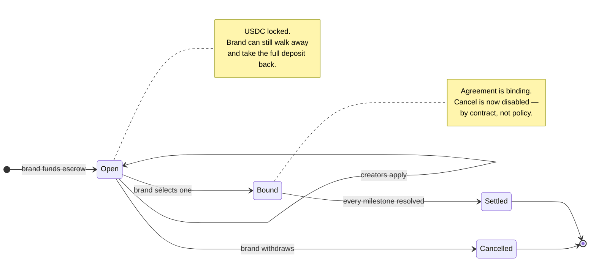
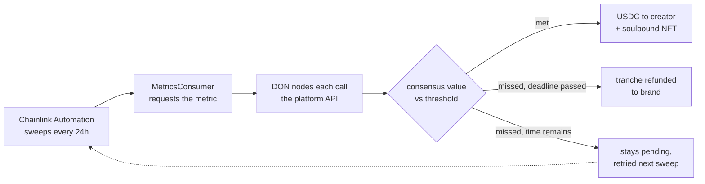
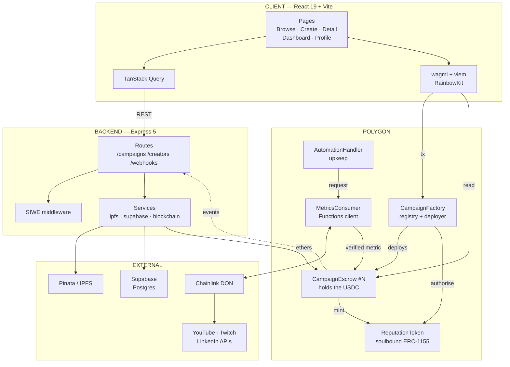

# Influencity

**Influencer sponsorships that pay themselves out.**

A brand locks USDC in escrow against measurable targets — 50,000 YouTube views, 10,000 Twitch concurrents. A creator delivers. A Chainlink oracle reads the real platform metric on-chain, and the contract releases the money the moment the number clears. Targets that expire unmet refund the brand automatically.

**Nobody approves a payment. There is no "pending review" step to hide behind.**

[](contracts/)
[](test/)
[](https://amoy.polygonscan.com/)
[](contracts/oracle/)
[](LICENSE)

---

## Deployed contracts — Polygon Amoy

| Contract | Address |
|---|---|
| CampaignFactory | [`0x42e0fe1AFFd173108BbDC921D5bFCf1527536Cd0`](https://amoy.polygonscan.com/address/0x42e0fe1AFFd173108BbDC921D5bFCf1527536Cd0) |
| ReputationToken | [`0x3a87F8737CfE6287236bd2Df41F48f3F71A21bD8`](https://amoy.polygonscan.com/address/0x3a87F8737CfE6287236bd2Df41F48f3F71A21bD8) |
| MockUSDC | [`0x68C6767ab108690DFab9eff93E5683E4F4EC3BEB`](https://amoy.polygonscan.com/address/0x68C6767ab108690DFab9eff93E5683E4F4EC3BEB) |
| MockMetricsOracle | [`0x13F29d51B05AF0d3A3cAB2c6Cf6e949A3cc23E15`](https://amoy.polygonscan.com/address/0x13F29d51B05AF0d3A3cAB2c6Cf6e949A3cc23E15) |

---

## The problem

Influencer marketing runs on trust in one direction. The creator posts first and invoices after. Payment terms stretch 30, 60, 90 days. Disputes get resolved by whoever holds more leverage, which is never the creator.

The usual escrow "fix" puts a human release button behind a wallet — the same discretion, new packaging. Influencity takes the other route: **if the payout condition is a number a machine can read, no human needs to hold that button at all.**

### Who it's for

| | |
|---|---|
| **Brands** | Pay for outcomes, not promises. Capital is committed but recoverable — targets missed by the deadline refund automatically, with no invoice dispute and no agency in the middle. |
| **Creators** | Terms that cannot be rewritten after delivery. A met threshold pays in the same transaction it's verified in, and every completed milestone becomes portable, unforgeable proof of performance. |
| **Agencies** | Programmatic campaigns across a roster, with settlement and reporting handled by the chain rather than a spreadsheet and a payments team. |

---

## How a campaign moves



Once bound, each milestone resolves independently:



A campaign carries up to 20 milestones, each with its own platform, metric, threshold, payout and deadline. They settle one at a time — a creator who hits two of three targets is paid for two, and the brand is refunded for the third. No all-or-nothing.

---

## Architecture

Four planes. The rule that shapes all of it: **money and truth live on-chain; everything else is a cache that can be rebuilt.**



### The contracts

| Contract | Role |
|---|---|
| `CampaignFactory` | Deploys one escrow per campaign, keeps the registry, wires each escrow into the oracle layer and the reputation token |
| `CampaignEscrow` | **One instance per campaign.** Holds the USDC, owns the milestone list, releases and refunds |
| `ReputationToken` | Soulbound ERC-1155, minted on every milestone met — non-transferable by construction |
| `MetricsConsumer` | Chainlink Functions client; the only address an escrow will accept a metric from |
| `AutomationHandler` | Chainlink upkeep that sweeps campaigns and triggers verification |
| `MilestoneLib` | Shared milestone struct, platform and metric enums, threshold and expiry logic |

---

## Why this architecture wins

**One escrow per campaign, not a shared pool.** Every deal gets its own contract holding only its own money. A bug, a stuck campaign or a hostile counterparty is contained to a single brand's funds instead of everyone's. It costs more gas per campaign and it buys a blast radius of one.

**Terms are physically uneditable.** The campaign brief is pinned to IPFS and its CID is written into the escrow's *constructor* — not a storage variable with a setter, a constructor argument. There is no function on the contract that can change what was agreed, for anyone, ever.

**The backend has no path to the money.** It pins IPFS content, reads chain state and mirrors events into Postgres. No route, no admin key and no signer on that server can move USDC out of an escrow. Compromise the API completely and the escrows are untouched — which is the difference between a web3 app and a web2 app with a wallet button.

**Postgres is disposable by design.** Every database write happens *after* its transaction confirms on-chain. Drop the entire database and no value is lost: the chain still holds every campaign, balance, milestone state and reputation token. Supabase exists to make the UI fast, not to be believed.

**Payouts are non-discretionary.** Only `MetricsConsumer` can deliver a metric, and the escrow itself compares it to the threshold. Neither the brand, nor the creator, nor the platform operator sits between a met milestone and its payment.

**Finalization cannot front-run verification.** A campaign cannot be settled while any milestone is still live. A brand cannot wait for a creator to hit the number and then close the campaign before the oracle reports — the contract refuses.

**Reputation cannot be bought.** `ReputationToken._update` reverts unless `from == address(0)`, so tokens mint and never move. A creator's track record is bound to their wallet and cannot be sold, transferred or laundered into a better-looking history.

**The oracle path is fault-tolerant, not just correct.** A Chainlink callback that reverts burns its gas and loses the paid-for result permanently, so `fulfillRequest` never reverts — unknown IDs, duplicate deliveries, malformed responses and an escrow that legitimately refuses a metric are all reported as events instead. One unrecoverable milestone cannot abort a sweep for every other campaign in the batch, and `performUpkeep` is gated on the Chainlink forwarder so nobody outside the registry can drain the LINK subscription.

**Written for the chain it runs on.** Every write waits three confirmations. Polygon PoS has ~2s blocks and routine short reorgs, and each write is followed by a database persist — at one confirmation, a reorg between the receipt and the `POST` leaves a row pointing at a contract the chain never kept.

---

## Testing

**156 passing, 0 failing.**

| Suite | Tests | Covers |
|---|---|---|
| `CampaignEscrow` | 50 | deposits, payouts, refunds, cancellation, finalization safety |
| `CampaignFactory` | 27 | creation, wiring, creator assignment, validation |
| `ReputationToken` | 23 | soulbound enforcement, minting, metadata |
| `AutomationHandler` | 22 | enrolment, sweeps, resilience, forwarder, manual override |
| `OracleFlow` | 14 | a full campaign through the mock oracle |
| `MetricsConsumer` | 13 | request routing, callback resilience |
| `OracleWiring` | 7 | the production wiring end to end against a mock DON router |

The oracle layer is tested against purpose-built mocks rather than assumed correct. `MockFunctionsRouter` stands in for the Chainlink router so the fulfillment callback is exercised without a live DON, and `MockMetricsConsumer` can be told to revert on demand — which is how "one failing request must not abort the sweep" is *proven* rather than asserted.

```bash
npm test
```

---

## Stack

| Layer | Choice |
|---|---|
| Contracts | Solidity 0.8.24 · Hardhat 3 · OpenZeppelin 5 · Chainlink Functions + Automation |
| Chain | Polygon Amoy (80002) · USDC, 6 decimals · 3 confirmations per write |
| Backend | Express 5 (ESM) · ethers v6 · Supabase (Postgres + RLS) · Pinata (IPFS) |
| Frontend | React 19 · Vite 8 · wagmi 2 + viem + RainbowKit · TanStack Query · Tailwind 4 + shadcn/ui |
| Auth | Sign-In With Ethereum — no passwords, no sessions, the wallet is the identity |

---

## Running it

```bash
# contracts
npm install
npm run build:abis          # compile + generate the server's ABIs
npm test

# deploy to Amoy
AMOY_GAS_PRICE_GWEI=25 npx hardhat run scripts/deploy.js --network polygonAmoy

# backend + frontend
cd server && npm install && npm run dev      # :3001
cd client && npm install && npm run dev      # :5173
```

Copy `.env.example` → `.env` and `client/.env.example` → `client/.env.local`, then fill them in. Apply both SQL files in `supabase/migrations/` before first run.

<details>
<summary><b>Two things that will cost you an afternoon</b></summary>

<br>

**The public Amoy RPC is dead.** `rpc-amoy.polygon.technology` does not respond. Use `https://polygon-amoy-bor-rpc.publicnode.com`. A wallet pointed at the dead endpoint reports a zero balance even when funded.

**Amoy's suggested gas price spikes to 450+ gwei** against a ~25 gwei floor, which quotes a 0.17 POL deploy at 3 POL. `AMOY_GAS_PRICE_GWEI` pins it.

</details>

---

## Layout

```
contracts/          core · oracle · libraries · interfaces · mocks
scripts/            deploy · deployOracle · verify · exportAbis · seedTestData
test/               7 suites, 156 tests
server/src/         routes · services · middleware · chainlink-functions
client/src/         pages · components · hooks · config
supabase/migrations/
```

`DOCUMENTATION.md` carries the full technical reference — data model, API surface, trust boundaries and contract-by-contract behaviour.

---

## License

MIT — see [LICENSE](LICENSE).

---

<sub>Built by <a href="https://github.com/gokulakrishnanjawahar">Gokulakrishnan Jawahar</a></sub>
