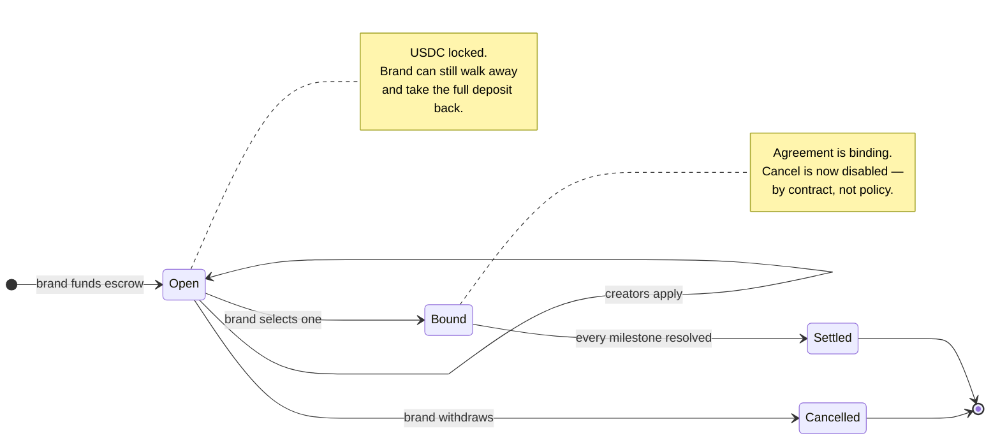
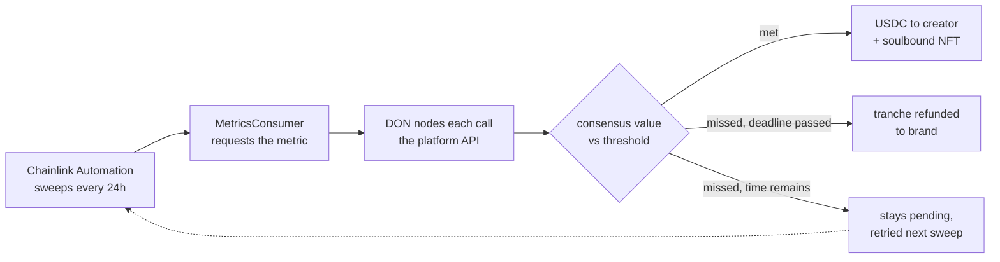
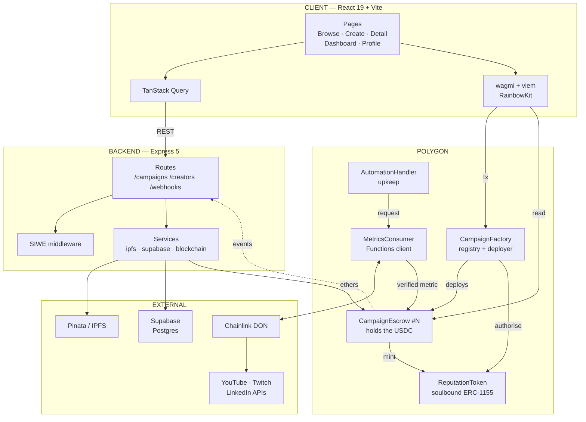

# Influencity

**Influencer sponsorships that pay themselves out.**

A brand locks USDC in escrow against measurable targets — 50,000 YouTube views, 10,000 Twitch concurrents. A creator delivers. A Chainlink oracle reads the real platform metric on-chain, and the contract releases the money the moment the number clears. Targets that expire unmet refund the brand automatically.

**Nobody approves a payment. There is no "pending review" step to hide behind.**

[](contracts/)
[](test/)
[](https://amoy.polygonscan.com/)
[](#license)

---

## Deployed contracts — Polygon Amoy

| Contract | Address |
|---|---|
| CampaignFactory | [`0x42e0fe1AFFd173108BbDC921D5bFCf1527536Cd0`](https://amoy.polygonscan.com/address/0x42e0fe1AFFd173108BbDC921D5bFCf1527536Cd0) |
| ReputationToken | [`0x3a87F8737CfE6287236bd2Df41F48f3F71A21bD8`](https://amoy.polygonscan.com/address/0x3a87F8737CfE6287236bd2Df41F48f3F71A21bD8) |
| MockUSDC | [`0x68C6767ab108690DFab9eff93E5683E4F4EC3BEB`](https://amoy.polygonscan.com/address/0x68C6767ab108690DFab9eff93E5683E4F4EC3BEB) |
| MockMetricsOracle | [`0x13F29d51B05AF0d3A3cAB2c6Cf6e949A3cc23E15`](https://amoy.polygonscan.com/address/0x13F29d51B05AF0d3A3cAB2c6Cf6e949A3cc23E15) |

> Testnet only, deliberately. Nothing here has custody of real money.

---

## The problem

Influencer marketing runs on trust in one direction. The creator posts first and invoices after. Payment terms stretch 30, 60, 90 days. Disputes are resolved by whoever has more leverage, which is never the creator.

The usual "web3 fix" is an escrow with a human release button — which just moves the same discretion behind a wallet. Influencity's bet is different: **if the payout condition is a number a machine can read, no human needs to hold that button at all.**

---

## How a campaign moves



Once bound, each milestone resolves on its own:



---

## Architecture

Four planes. The rule that shapes all of it: **money and truth live on-chain; everything else is a cache that can be rebuilt.**



### Contracts

| Contract | Role |
|---|---|
| `CampaignFactory` | Deploys one escrow per campaign, keeps the registry, wires each escrow into the oracle layer |
| `CampaignEscrow` | **One instance per campaign.** Holds the USDC, owns the milestone list, releases and refunds |
| `ReputationToken` | Soulbound ERC-1155, minted on every milestone met — non-transferable by construction |
| `MetricsConsumer` | Chainlink Functions client; the only address an escrow will accept a metric from |
| `AutomationHandler` | Chainlink upkeep that sweeps campaigns and triggers verification |

---

## Why this works

**One escrow per campaign.** A bug or a stuck deal damages one contract holding one brand's money, not a shared pool holding everyone's. It costs more gas per campaign and it is worth it.

**The terms cannot be edited.** The brief is pinned to IPFS and its CID is written into the escrow's constructor. Not a storage variable someone can update later — a constructor argument. Whatever both parties agreed to is what the contract will enforce, permanently.

**The backend cannot move money.** It reads chain state and relays IPFS CIDs. There is no code path from an HTTP request to a USDC transfer. Compromise the server entirely and the escrows are untouched.

**Postgres is disposable.** Every database write happens *after* the corresponding transaction confirms. Drop the whole database and the chain still holds every campaign, balance, and reputation token. Supabase exists to make the UI fast, not to be believed.

**Reputation cannot be bought.** `ReputationToken._update` reverts unless `from == address(0)`, so tokens mint and never move. A creator's history is theirs and cannot be sold to someone with a worse one.

**Finalization cannot front-run the oracle.** A brand cannot settle a campaign while a milestone is still live. That guard is the fix for the worst bug I found in my own code — see below.

---

## Why this doesn't work (yet)

Being straight about this matters more to me than the pitch.

**The oracle is not live.** `MetricsConsumer` and `AutomationHandler` are written, tested against a mock DON router, and have a deploy script — but the deployed campaigns currently point at `MockMetricsOracle`, which I trigger manually. Going live needs a funded Chainlink Functions subscription, DON-hosted API secrets, and a registered upkeep. **Until then the "trustless" claim is architecture, not production fact.**

**A metric is not a truth.** The DON reaches consensus that YouTube's API *returned* 50,000 views. It cannot tell you those views were real. Bot traffic satisfies this contract exactly as well as an audience does. Solving that is a fraud-detection problem, not a smart-contract one, and I have not solved it.

**Deadlines are the creator's whole risk.** Miss by an hour and the tranche refunds to the brand. There is no grace period, no partial credit for 49,000 views against a 50,000 target. That is a deliberate simplification and it is harsh.

**The oracle costs real LINK per check.** Every campaign × every pending milestone × every 24-hour sweep is a paid request. At scale the verification bill grows faster than the campaign count. Batching or event-triggered checks would be the fix.

**Badge NFTs don't render yet.** The contract stores per-token metadata URIs, but nothing populates them, so wallets show blank tokens. An integration gap, not a contract bug.

**`optionalAuth` is not authentication.** Read routes check address *format* only — a caller can claim any address. Fine while everything it guards is public by RLS policy; it must never gate anything private.

**Deployed contracts are not verified on PolygonScan.** The bytecode is public and readable either way, but source verification is still pending an Etherscan V2 key.

---

## What auditing my own contracts turned up

I rewrote the test suite before touching any logic, and it changed the picture completely. The existing tests had been written against a pre-refactor API and silently stopped covering anything — **27 passing, 41 failing, and zero working tests across the two files that move money.**

With coverage restored, two critical bugs surfaced in exactly that untested region.

### 1. The brand could drain a live campaign

`finalizeCampaign()` failed expired milestones, then swept the **entire remaining balance** to the brand:

```solidity
for (...) { if (PENDING && isExpired(m)) _failMilestone(i); }   // only expired ones
uint256 remainder = usdc.balanceOf(address(this));              // ← everything else
usdc.transfer(brand, remainder);
```

A brand could let a creator deliver, watch the view count clear the threshold, and call `finalizeCampaign()` in the window before the oracle reported — recovering a tranche the creator had already earned. It defeated the project's entire premise.

The fix refuses to finalize while any milestone is still live. Five tests cover it, including one where the creator has submitted proof and the oracle hasn't yet responded.

### 2. The oracle could never have paid anyone

`requestMetric` recorded the caller as the delivery target:

```solidity
pendingRequests[requestId] = RequestContext({
    escrowAddress: msg.sender,   // ← the AutomationHandler, never the escrow
    ...
});
```

The only caller is `AutomationHandler`, so every result was filed against the handler's address. On fulfillment the callback would have invoked `receiveVerifiedMetric` on a contract that has no such function. **The automated payout path was broken end to end**, and it would only have surfaced after a live Chainlink deployment and a burned LINK subscription. The escrow is now an explicit, validated parameter.

### Also fixed

- **Callback gas was too low** — measured, not guessed: a milestone-met fulfillment uses **310,702 gas** against a configured 300,000 limit. A *successful* verification would have run out of gas mid-callback and silently failed to pay. Raised to 500k.
- **`fulfillRequest` could revert** — a revert in a DON callback burns the callback gas and loses the paid-for result permanently. It now handles unknown IDs, duplicates, malformed responses, and a refusing escrow without ever reverting.
- **One bad milestone aborted the entire sweep**, stalling every other campaign in the batch.
- **Finalised campaigns were swept forever**, paying LINK to re-check dead campaigns.
- **`performUpkeep` was unrestricted** — now gated on the Chainlink forwarder.
- **The factory never wired escrows into the oracle**, so a real deployment would have produced campaigns that could never be verified.

---

## Testing

**156 passing, 0 failing.**

| Suite | Tests | Covers |
|---|---|---|
| `CampaignEscrow` | 50 | deposits, payouts, refunds, cancellation, finalization safety |
| `CampaignFactory` | 27 | creation, wiring, creator assignment, validation |
| `ReputationToken` | 23 | soulbound enforcement, minting, metadata |
| `AutomationHandler` | 22 | enrolment, sweeps, resilience, forwarder, manual override |
| `OracleFlow` | 14 | a full campaign through the mock oracle |
| `MetricsConsumer` | 13 | request routing, callback resilience |
| `OracleWiring` | 7 | the production wiring end to end against a mock DON router |

`MockFunctionsRouter` stands in for the Chainlink router so the fulfillment path is testable without a live DON. `MockMetricsConsumer` can be told to revert on demand, which is how the "one bad request must not abort the sweep" guarantee is actually proven rather than asserted.

```bash
npm test
```

---

## Stack

| Layer | Choice |
|---|---|
| Contracts | Solidity 0.8.24 · Hardhat 3 · OpenZeppelin 5 · Chainlink Functions + Automation |
| Chain | Polygon Amoy (80002) · USDC, 6 decimals · 3 confirmations per write |
| Backend | Express 5 (ESM) · ethers v6 · Supabase (Postgres + RLS) · Pinata (IPFS) |
| Frontend | React 19 · Vite 8 · wagmi 2 + viem + RainbowKit · TanStack Query · Tailwind 4 + shadcn/ui |
| Auth | Sign-In With Ethereum — no passwords, no sessions |

Three confirmations on every write is deliberate. Polygon PoS has ~2s blocks and routine short reorgs, and every write is followed by a database persist — at one confirmation, a reorg between the receipt and the `POST` leaves a row referencing a contract the chain never kept.

---

## Running it

```bash
# contracts
npm install
npm run build:abis          # compile + generate the server's ABIs
npm test

# deploy to Amoy
AMOY_GAS_PRICE_GWEI=25 npx hardhat run scripts/deploy.js --network polygonAmoy

# backend + frontend
cd server && npm install && npm run dev      # :3001
cd client && npm install && npm run dev      # :5173
```

Copy `.env.example` → `.env` and `client/.env.example` → `client/.env.local`, then fill them in. Apply both SQL files in `supabase/migrations/` before first run.

<details>
<summary><b>Two things that will cost you an afternoon</b></summary>

<br>

**The public Amoy RPC is dead.** `rpc-amoy.polygon.technology` does not respond. Use `https://polygon-amoy-bor-rpc.publicnode.com`. A wallet pointed at the dead endpoint shows a zero balance even when funded, which is an unusually good way to waste two days re-claiming from a faucet.

**Amoy's suggested gas price spikes to 450+ gwei** against a ~25 gwei floor, which quotes a 0.17 POL deploy at 3 POL. `AMOY_GAS_PRICE_GWEI` pins it.

</details>

---

## Layout

```
contracts/          core · oracle · libraries · interfaces · mocks
scripts/            deploy · deployOracle · verify · exportAbis · seedTestData
test/               7 suites, 156 tests
server/src/         routes · services · middleware · chainlink-functions
client/src/         pages · components · hooks · config
supabase/migrations/
```

`DOCUMENTATION.md` carries the full technical reference — data model, API surface, trust boundaries, and every known gap.

---

## License

MIT

---

<sub>Built by <a href="https://github.com/gokulakrishnanjawahar">Gokulakrishnan Jawahar</a>. Testnet only — no real funds at risk.</sub>
